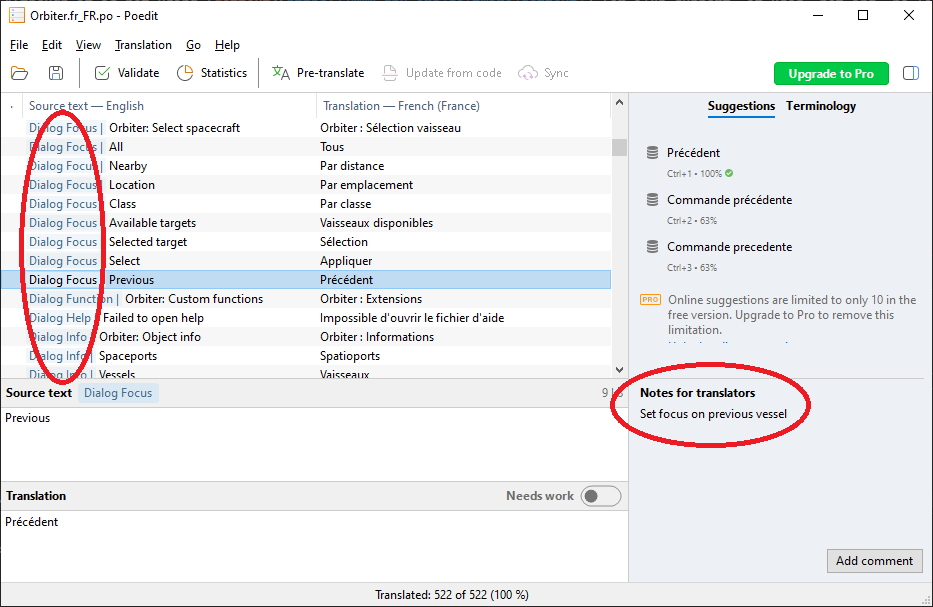

# Internationalization (i18n)

Orbiter allows for the translation of its UI elements to other languages.
Although it is not using [gettext](https://www.gnu.org/software/gettext/) for i18n support, it uses .pot and .po files
that should be mostly compatible with standard gettext tools used to translate programs.
[Poedit](https://poedit.net/) has been used successfully for example.

## Template files
Portable Object Template (.pot) files contain message strings to be translated. They are automatically created at build time with two tools:

 - Utils/xgettext.lua for extracting strings from C++/Lua code
 - Utils/dat2pot.lua for extracting strings from flight recordings data (system.dat)

The .pot files are committed to the git repo.

Flight recordings have dedicated "system.pot" files created, each inside its own Flights/_scenario_/ directory.

The Orbiter Core is using the Src/Orbiter/i18n/Orbiter.pot file.

Modules can also have their own template files, created in an i18n directory, usually named after the module (for example Src/Plugin/ExtMFD/i18n/ExtMFD.pot)

Finally, some Lua scripts present in the Script directory also contain translatable strings. The .pot files are located in the same directory
as the Lua file.

## Translation files
To provide a translation, you need to create .po files from .pot files.
The Orbiter core is using a naming convention to load the translation files during runtime : if a locale xxx is used, it will
load all the *.xxx.po files that are provided in the i18n directory.
To limit conflicts, you should name your .po files after their original .pot files : Orbiter.pot -> Orbiter.xxx.po

Most strings are associated with a context, and some have translators notes to help :


Some tools may "compile" your .po files to .mo files. Orbiter does not use them.

A list of .pot files and translation status are available [here](TRANSLATIONS.md).

Note : Orbiter only support UTF-8 encoded .po files

### Locale name
Orbiter will look for a specific message "LANGUAGE_NAME" associated to a specific context "locale" in order to show your
locale name in the language selection dialog. This message is located in the Orbiter.pot file and must be defined.

## Content creators

### Code instrumentation
There is no magical way of identify strings that need to be translated. The source files must be instrumented
so that tools can later extract the messages to be translated. This is done with gettext-like macros :

 - _("message"): extract the message, no context is provided (or use a default context, see below) :
```
if(ImGui::Button(_("Add"), button_sz)) {
	g_camera->AddPreset();
}
```
 - _c("context", "message")" extract the message, using a context :
```
skp->Text(grp->Vtx[200].x + w/2 + 1, grp->Vtx[200].y+btnyoffset, _c("MFD Button", "SEL"), 0);
```

- _core("context", "message"): use a translation already provided by the Orbiter core. It won't be extracted from this file :
```
skp->Text(149, 177, _core("MFD Button", "SEL"), 0);
```

- _name(): for when you want to allow the translation of a planet or moon. No extraction will be performed :
```
menu->Append (_name(star->Name()));
```

- _revname(): used when you need to translate a user provided planet/moon back to its original name :
```
Vessel *obj = g_psys->GetVessel (_revname(name), true);
```

- _card(): translate cardinal directions (N/S/E/W)
```
ImGui::Text("%07.3f°%s  %06.3f°%s",fabs(lng)*DEG, lng >= 0.0 ? _card("E"):_card("W"),fabs(lat)*DEG, lat >= 0.0 ? _card("N"):_card("S"));
```

To use these macros, you must include the "I18NAPI.h" file.
Before including this file, you can define a default context with the TRANSLATION_CONTEXT macro :
```
#define TRANSLATION_CONTEXT "Dialog Focus"
#include "I18NAPI.h"
```

Only define the macro ONCE, before including the header.

To help the translators, you can also add translators notes with a special comment, before using a translation macro :
```
// TRANSLATORS: Reset cockpit to forward direction
if(ImGui::Button(_("Forward"))) {
	g_camera->ResetCockpitDir();
}
```

### Scripting
The Lua interpreter provides a subset of functions to handle localization : _(), _name() and _revname() work the same as in C++.

Declaring a default context is done with the i18n.set_context() function :
```
i18n.set_context("ShuttleA ADI tutorial")
```


### Installation
The Orbiter core is expecting the .po files to be located in an i18n directory at the root of the installation directory.

### Misc
Only add translation hooks for user facing elements. Do not save localized strings to config or scenario files. It
would prevent using them from an installation using a different locale.

If you're working on a closed source module, you may consider providing your .pot files so that third parties can still provide translations.

## Caveat

### Text layout
Some graphical elements rely on text size and/or spaces for vertical alignment. Care must be taken when
providing a translation to stay consistent with the original text and make sure that the layout is acceptable.

Some text strings are displayed inside limited sized element ; depending on the verbosity of your target language, you may need
to use abbreviations to prevent overflows or croppings.

## ImGui's peculiarities
ImGui requires unique IDs for its interactible graphical elements (for example you cannot have two "OK" buttons in the same child
element without extra precautions).
If during translation you end up in this situation, you must somehow provide different labels for the colliding names.
The usual way is to add a special suffix that ImGui will hide when displaying the element. For example "OK##button1" and "OK##button2"
will show 2 "OK" buttons, but without any ID collision.